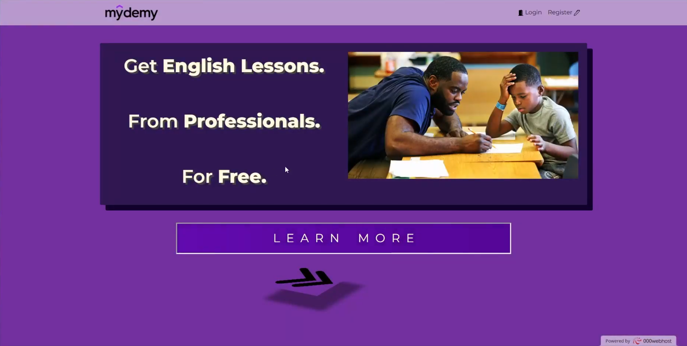
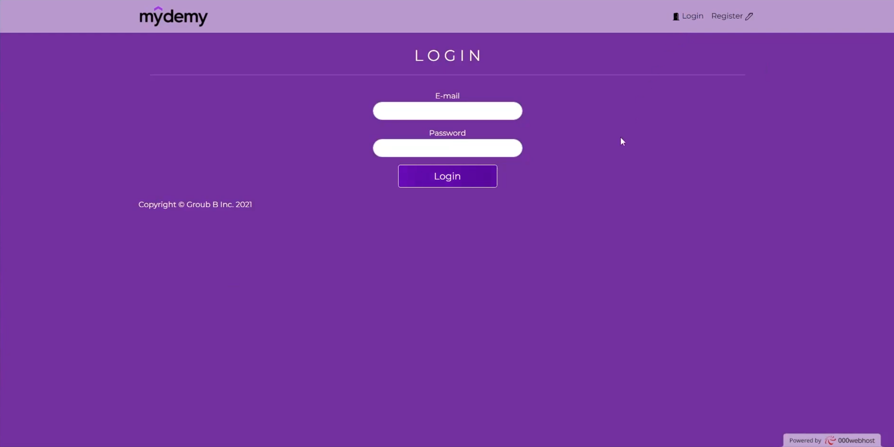
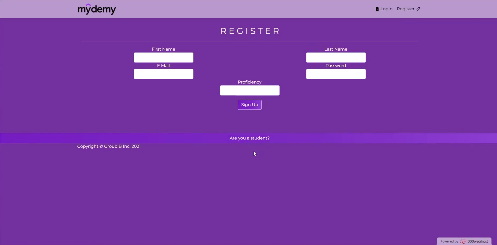
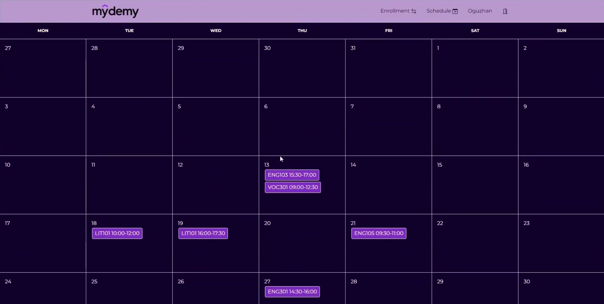
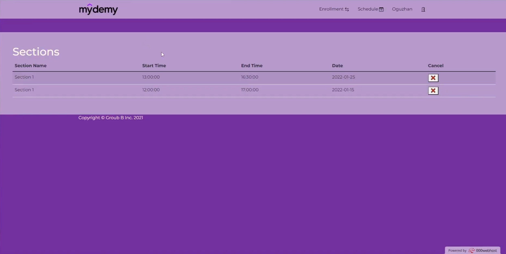
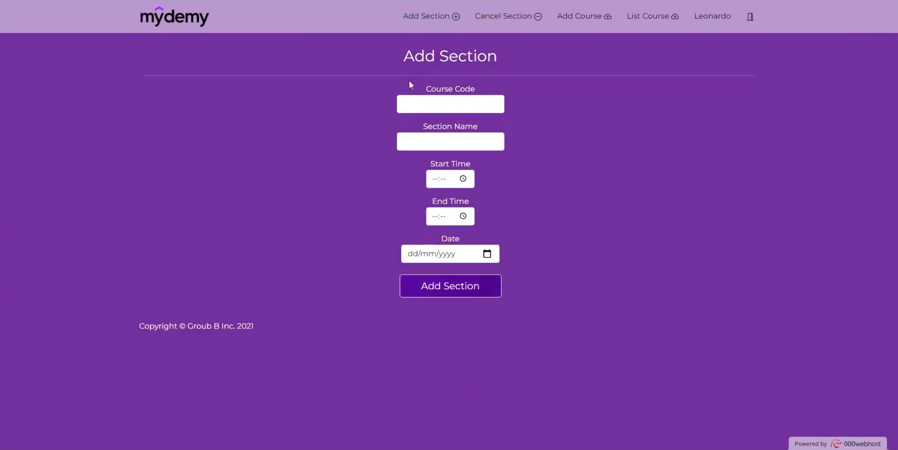

# WebFinalProject

## Mydemy Education

Mydemy is a CRUD website developed with HTML, CSS, JS, PHP and MySQL. Mydemy offers free English lessons to students in need by connecting them to volunteer instructors.

## Video Presentation of the Website

[YouTube](https://youtu.be/hiAZWlg586s)

## Screenshots

